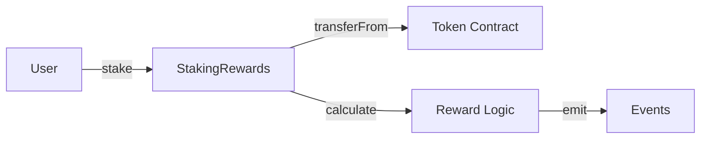

# Architecture Documentation

> **Purpose**: Document system design decisions, contract structure, data models, and integration patterns.
> **Updated by**: Orchestrator, contract-developer, frontend-developer when architecture changes
> **Read by**: All agents before making design decisions

---

## System Architecture Overview

**Status**: Not yet defined

**High-Level Description**: [Awaiting project initialization]

---

## Smart Contract Architecture

### Contract Structure

**Contracts**: None yet

**Example Entry** (template):
```
📄 StakingRewards.sol
   Purpose: Manages staking deposits and reward distribution
   Inheritance: Ownable, ReentrancyGuard, Pausable
   Key Functions:
     - stake(uint256 amount)
     - withdraw(uint256 amount)
     - claimRewards()
   Storage:
     - mapping(address => uint256) public stakes
     - mapping(address => uint256) public rewards
   Events:
     - Staked(address indexed user, uint256 amount)
     - Withdrawn(address indexed user, uint256 amount)
```

### Contract Interactions

**Interaction Flow**: Not yet defined

**Example Diagram** (template):


### Upgradability Strategy

**Pattern**: Not yet defined

Options:
- [ ] Transparent Proxy Pattern (OpenZeppelin)
- [ ] UUPS Proxy Pattern
- [ ] Diamond Pattern (EIP-2535)
- [ ] Immutable (no upgrades)
- [ ] Other: ___________

**Rationale**: [To be documented when decided]

---

## Multi-Chain Strategy

### Chain-Specific Considerations

**Ethereum Mainnet**:
- Gas optimization: [Strategy TBD]
- Block time: ~12 seconds
- Special considerations: [TBD]

**Solana**:
- Framework: Anchor
- Language: Rust
- Account model differences: [Document when implementing]

**BSC**:
- Fork of Ethereum
- Lower gas costs
- Considerations: [TBD]

**Avalanche**:
- Subnet architecture
- Fast finality
- Considerations: [TBD]

### Cross-Chain Bridge Strategy

**If applicable**:
- [ ] Wormhole
- [ ] LayerZero
- [ ] Chainlink CCIP
- [ ] Native bridges
- [ ] Not needed

---

## Data Models

### On-Chain Data Structures

**Example Entry** (template):
```solidity
struct StakeInfo {
    uint256 amount;        // Amount staked
    uint256 timestamp;     // When stake was created
    uint256 rewardDebt;    // For reward calculation
    bool active;           // Stake status
}
```

### Off-Chain Data (if applicable)

**Database Schema**: Not yet defined

**Storage Solutions**:
- [ ] IPFS (for metadata)
- [ ] Arweave (for permanent storage)
- [ ] Traditional database (for indexing)
- [ ] The Graph (for querying)

---

## Frontend Architecture

### Technology Stack

**Framework**: Not yet defined

**Suggested Stack**:
- [ ] Next.js 14+ (App Router)
- [ ] React 18+
- [ ] TypeScript
- [ ] TailwindCSS

**Web3 Integration**:
- [ ] wagmi (React Hooks for Ethereum)
- [ ] viem (TypeScript Ethereum library)
- [ ] RainbowKit (Wallet connection UI)
- [ ] ethers.js (Alternative)

### Component Structure

**Pattern**: Not yet defined

**Example Structure** (template):
```
src/
├── components/
│   ├── wallet/
│   │   └── ConnectWallet.tsx
│   ├── staking/
│   │   ├── StakeForm.tsx
│   │   └── StakeStats.tsx
├── hooks/
│   ├── useStaking.ts
│   └── useRewards.ts
├── contracts/
│   └── abis/
│       └── StakingRewards.json
└── lib/
    └── wagmi-config.ts
```

### State Management

**Strategy**: Not yet defined

Options:
- [ ] React Context + Hooks
- [ ] Zustand
- [ ] Redux Toolkit
- [ ] Jotai
- [ ] Other: ___________

---

## Security Architecture

### Access Control

**Pattern**: Not yet defined

**Roles** (if using role-based access):
- Admin
- Operator
- User

**Implementation**:
- [ ] OpenZeppelin AccessControl
- [ ] Custom implementation
- [ ] Multi-sig (Gnosis Safe)

### Security Mechanisms

**Implemented Protections**:
- [ ] ReentrancyGuard
- [ ] Pausable
- [ ] Rate limiting
- [ ] Emergency withdrawal
- [ ] Timelocks
- [ ] Other: ___________

---

## Integration Points

### External Protocols

**Integrations**: None yet

**Example Entry** (template):
```
🔗 Uniswap V3
   Purpose: Liquidity provision and swapping
   Contracts Used:
     - SwapRouter (0x...)
     - QuoterV2 (0x...)
   Integration Pattern: Direct contract calls
   Testnet Addresses: [List]
   Mainnet Addresses: [List]
```

### Oracles & Price Feeds

**Price Data Sources**: Not yet defined

Options:
- [ ] Chainlink Price Feeds
- [ ] Uniswap TWAP
- [ ] Custom oracle
- [ ] Other: ___________

---

## Testing Architecture

### Testing Strategy

**Levels**:
1. **Unit Tests** - Individual function testing
2. **Integration Tests** - Contract interaction testing
3. **Fork Tests** - Mainnet fork simulation
4. **Fuzzing** - Property-based testing (Echidna)
5. **Formal Verification** - (Optional, for critical contracts)

**Framework**:
- [ ] Foundry (Forge) - **Recommended**
- [ ] Hardhat (Mocha/Chai)
- [ ] Both

**Coverage Target**: 90%+ minimum

### Test Organization

**Structure** (template):
```
test/
├── unit/
│   ├── StakingRewards.t.sol
│   └── RewardCalculator.t.sol
├── integration/
│   └── StakingFlow.t.sol
├── fork/
│   └── UniswapIntegration.t.sol
└── fuzz/
    └── StakingInvariants.t.sol
```

---

## Deployment Architecture

### Environment Strategy

**Environments**:
1. **Local** - Hardhat/Foundry local node
2. **Testnet** - Sepolia (Ethereum), Devnet (Solana), etc.
3. **Staging** - (Optional) Dedicated testnet deployment
4. **Production** - Mainnet

### Deployment Pipeline

**Process**: Semi-automated (testnet auto, mainnet manual approval)

**Steps**:
1. Run full test suite
2. Run security scans (Slither + Mythril)
3. Generate deployment artifacts
4. Deploy to testnet
5. Verify contracts on block explorer
6. Run integration tests on testnet
7. **Manual approval gate** ⚠️
8. Deploy to mainnet
9. Verify on mainnet explorer
10. Update DEPLOYMENT_STATE.md

### Contract Verification

**Block Explorers**:
- Etherscan (Ethereum, BSC, Avalanche)
- Solscan (Solana)
- Verification: Automated via Hardhat/Foundry plugins

---

## Monitoring Architecture

### Post-Deployment Monitoring

**Strategy**: Custom monitoring solution

**What to Monitor**:
- [ ] Contract events (via The Graph or custom indexer)
- [ ] Transaction failures
- [ ] Gas usage patterns
- [ ] Economic attacks (front-running, MEV)
- [ ] Admin actions (if applicable)

**Tools**:
- [ ] Tenderly
- [ ] Custom event listener
- [ ] The Graph subgraph
- [ ] OpenZeppelin Defender (Sentinel)

### Alerting

**Alert Channels**: Not yet configured

**Alert Conditions**: To be defined

---

## Architecture Decision Records (ADRs)

### Template for Recording Decisions

**Format**:
```markdown
## ADR-001: [Decision Title]

**Date**: YYYY-MM-DD
**Status**: Proposed | Accepted | Deprecated
**Deciders**: [Who made the decision]

### Context
[What is the issue we're addressing]

### Decision
[What we decided to do]

### Consequences
**Positive**:
- [Benefit 1]

**Negative**:
- [Trade-off 1]

**Alternatives Considered**:
- [Alternative 1] - [Why rejected]
```

---

## Decision Log

### ADR-000: Framework Selection
**Date**: 2025-11-12
**Status**: Accepted
**Decision**: Use BlockchainOrchestra framework with Claude Skills for blockchain development
**Rationale**: Token efficiency, context preservation, multi-chain support, solo-dev friendly

---

## Diagrams

### System Architecture Diagram

**Status**: Not yet created

**Location**: Will be generated in `docs/generated/architecture-diagram.md`

---

## Instructions for Agents

**When making architectural changes:**

1. ✅ Update relevant section in this file
2. ✅ Add ADR if decision is significant
3. ✅ Update diagrams if structure changes
4. ✅ Notify in PROJECT_STATE.md "Recent Updates"
5. ✅ Consider impact on other contracts/components

**Before implementing features:**

1. 📖 Read this file to understand current architecture
2. 📖 Check if similar patterns exist (reuse > rebuild)
3. 📖 Verify your design doesn't conflict with existing decisions

---

**Last Updated**: [Not yet initialized]
**Updated By**: System (template)
